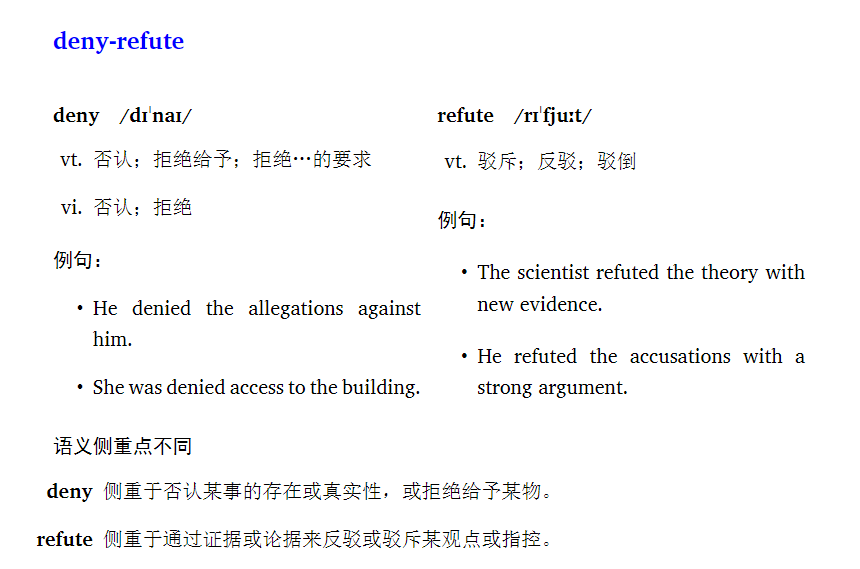

# 📚 AIWordsComparison — 批量生成英语近义词比较文档（JSON + LaTeX）

本项目用于批量处理英语近义词组，通过 DeepSeek API 获取每个词的含义、音标、例句以及词义对比，并自动生成：
- 每组单词的结构化 JSON 文件；
- 支持 XeLaTeX 编译的 LaTeX 文件，可生成美观的 PDF 比较文档。

---

## ✨ 功能特色

- ✅ 自动调用 [DeepSeek Chat API](https://api-docs.deepseek.com/zh-cn/) 分析近义词；
- ✅ 输出标准格式的 JSON 文件，便于后续 NLP / 教学使用；
- ✅ 自动生成含有多栏词汇解释与词义比较的 LaTeX 文档；
- ✅ 支持音标、中文释义、例句、对比维度；
- ✅ 可批量处理 Excel 中的所有词组。
- 🙋‍♂️ 作者本人整理完data后将上传，预计在2025/6/14 CET6考完后。

---

## 📁 输入文件格式

默认读取文件：`data.xlsx`  
格式要求：**每一行是一组要比较的同义词**，每组用单元格分隔。

示例：

| A        | B        | C      |
|----------|----------|--------|
| start    | commence |        |
| deny     | refute   |        |
| swell    | increase |        |

---

## 🔧 使用方法

### 1. 安装依赖

```bash
pip install pandas openai
```

### 2. 设置 DeepSeek API Key

请将 `main.py` 中的 `token = "YOUR-TOKEN"` 替换为你自己的 DeepSeek API Key。

如果没有，自行前往 [DeepSeek API](https://platform.deepseek.com/api_keys) 获取。

### 3. 运行程序

```bash
python main.py
```

- 所有词组的 JSON 文件将保存在 `json_file/` 目录；
- 所有内容整合为一个 LaTeX 文件：`vocab_comparison.tex`。

### 4. 编译 LaTeX 文件（推荐 XeLaTeX）

使用 XeLaTeX 编译生成 PDF：

```bash
xelatex vocab_comparison.tex
```

或者在 TeXstudio 中选择 `XeLaTeX` 编译方式。

---

## 📌 依赖项

- Python 3.8+
- pandas
- openai（用于调用 DeepSeek API）
- XeLaTeX 编译器（生成 PDF）

---

## 📄 输出示例（LaTeX）

```latex
\section*{start-commence}
\begin{multicols}{2}
\subsection*{\textbf{start} \quad /stɑːrt/}
\begin{itemize}
\item[vt.vi.] 开始；发动；开办；以…起家
\end{itemize}
\textbf{例句：}
\begin{itemize}
\item The meeting started at 9 a.m.
\end{itemize}
...[README.md](README.md)
\end{multicols}
```

---

## 📜 License

MIT License

---

## 🙋‍♂️ 作者

由 DogPy 开发。欢迎 issue 和 PR！
